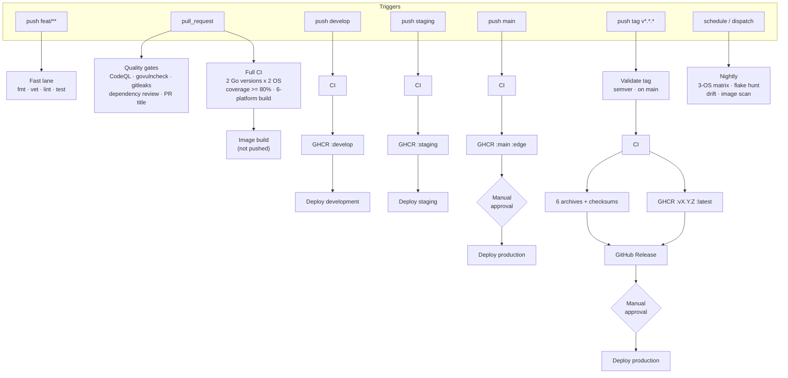

# ci-cd-example

A complete, runnable **GitHub Actions CI/CD pipeline** built around a small Go HTTP service.

The app is deliberately tiny. The pipeline is the point: eight trigger types, three reusable
workflows, a composite action, matrix builds, container publishing to GHCR, signed-off releases,
and environment-gated deployments.

> **Deploys are simulated.** `scripts/deploy.sh` prints the deployment it *would* perform and exits.
> Everything around it — environments, approval gates, deployment records, image digests, smoke
> tests — is real. That means the whole pipeline runs green with **zero secrets to configure**.
> See [Making the deploys real](#making-the-deploys-real).

---

## Pipeline at a glance



## Triggers

| Trigger | Workflow | What runs |
| --- | --- | --- |
| Push to `feat/**`, `fix/**`, `chore/**`, `refactor/**` | [`push-feature.yml`](.github/workflows/push-feature.yml) | Fast lane: gofmt, vet, tidy, lint, tests on one Go version. No build, no image. |
| Pull request → `develop` / `staging` / `main` | [`pr.yml`](.github/workflows/pr.yml) | Full CI matrix (Go 1.25 + 1.26 × Linux + macOS), coverage gate, six-platform cross-compile, container build **without** pushing. |
| Pull request (any) | [`code-quality.yml`](.github/workflows/code-quality.yml) | CodeQL, govulncheck, gitleaks, dependency review, conventional PR title, actionlint. |
| Push to `develop` | [`cd-develop.yml`](.github/workflows/cd-develop.yml) | CI → publish `:develop` + `:sha-<short>` → deploy **development** (automatic). |
| Push to `staging` | [`cd-staging.yml`](.github/workflows/cd-staging.yml) | CI → publish `:staging` → deploy **staging** (automatic) + smoke test. |
| Push to `main` | [`cd-production.yml`](.github/workflows/cd-production.yml) | CI → publish `:main` + `:edge` → deploy **production** (**manual approval**). |
| Push tag `v*.*.*` | [`release.yml`](.github/workflows/release.yml) | Validate tag → CI → archives + checksums → GitHub Release → publish `:vX.Y.Z` + `:latest` → deploy production. |
| Nightly cron `03:00 UTC` | [`nightly.yml`](.github/workflows/nightly.yml) | 3-OS × 2-Go matrix, 10× flake hunt, dependency drift, Trivy scan of the published image. |
| Weekly cron `Mon 04:00 UTC` | [`code-quality.yml`](.github/workflows/code-quality.yml) | Re-scan unchanged code for newly published advisories. |
| Manual (`workflow_dispatch`) | [`manual-deploy.yml`](.github/workflows/manual-deploy.yml) | Deploy any published tag or digest to any environment. This is the rollback path. |

## Workflow structure

The logic lives in three reusable workflows. Every trigger file is a thin caller, so there is
exactly one definition of "CI passed" and one definition of "deployed".

```
.github/
├── actions/setup-go-env/action.yml   Composite: install Go, restore caches, verify modules
└── workflows/
    ├── _reusable-ci.yml              meta → format → lint → test matrix → build matrix → ci-ok gate
    ├── _reusable-docker.yml          Buildx multi-arch → GHCR → Trivy → digest output
    ├── _reusable-deploy.yml          GitHub Environment → deploy.sh → smoke test
    │
    ├── push-feature.yml              ─┐
    ├── pr.yml                         │
    ├── cd-develop.yml                 ├─ callers
    ├── cd-staging.yml                 │
    ├── cd-production.yml              │
    ├── release.yml                    │
    ├── manual-deploy.yml             ─┘
    ├── code-quality.yml              security + hygiene (standalone)
    └── nightly.yml                   scheduled full surface
```

Three details worth copying:

- **`ci-ok` / `pr-ready` gate jobs.** Branch protection points at one job that `needs:` everything
  else. Add a matrix leg and you never have to touch the protection rules.
- **Digest-pinned deploys.** `_reusable-docker.yml` outputs `ghcr.io/owner/repo@sha256:…`, not a tag,
  so a deploy can never pick up a different image than the one that was scanned.
- **Asymmetric concurrency.** PR and feature runs use `cancel-in-progress: true`; deploys use
  `false`, because cancelling a half-applied rollout is worse than queueing.

## Branching model

```
feat/my-thing ──PR──▶ develop ──PR──▶ staging ──PR──▶ main ──tag v1.2.3──▶ release
     fast lane        deploy dev      deploy stg    deploy prod        deploy prod
                                                     (approval)         (approval)
```

- Feature branches get fast feedback and nothing else.
- `develop` is always deployable to the development environment.
- `staging` is the release candidate.
- `main` is what production runs.
- Tags are cut from `main` — the release workflow **refuses** a tag that is not an ancestor of `main`.
- Prereleases (`v1.2.3-rc.1`) publish a release and an image, but are never tagged `latest` and are
  never deployed to production.

## The app

A single Go binary with no third-party dependencies.

| Endpoint | Purpose |
| --- | --- |
| `GET /healthz` | Liveness. 200 until the process dies. |
| `GET /readyz` | Readiness. Flips to 503 the moment a shutdown signal arrives, so a load balancer drains before the listener closes. |
| `GET /version` | Build metadata injected via `-ldflags`. The release workflow asserts this matches the git tag. |
| `GET /api/todos/stats` | Aggregate counts (total / done / pending), taken under a single lock. |
| `GET/POST /api/todos`, `GET/PUT/DELETE /api/todos/{id}` | An in-memory CRUD resource, so the smoke test exercises a real write path. |

```
cmd/server/          main + config (graceful shutdown, env parsing)
internal/api/        http.ServeMux with Go 1.22+ method patterns, request logging
internal/store/      mutex-guarded store — this is what `go test -race` is for
internal/version/    ldflags-injected Version / Commit / BuildDate
```

## Local development

Every CI step is a `make` target, so `make ci` locally runs what the PR pipeline runs.

```bash
make help          # list targets
make test          # go test ./... -race -covermode=atomic -coverprofile=coverage.out
make cover         # tests + the 80% coverage gate
make lint          # golangci-lint (via Docker if not installed locally)
make build         # host binary into bin/
make build-all     # six release archives + checksums into dist/
make docker        # multi-stage image build
make run           # go run ./cmd/server
make ci            # fmt-check + vet + lint + cover + build

# End to end, by hand:
make run &
./scripts/smoke-test.sh http://localhost:8080
```

Scripts, all usable outside CI:

| Script | Purpose |
| --- | --- |
| `scripts/coverage.sh` | Parse `go tool cover -func` and fail below `COVERAGE_MIN` (default 80). |
| `scripts/test-summary.sh` | Turn `go test -json` into a markdown job summary. |
| `scripts/build-release.sh` | Cross-compile six platforms, archive, write `checksums.txt`. |
| `scripts/smoke-test.sh` | Probe `/healthz`, `/readyz`, `/version`, then create and read a todo. |
| `scripts/deploy.sh` | **The stub.** Validates inputs, prints an ordered plan, writes a job summary. |

## Repository setup

The workflows assume a few repository settings. Nothing here is needed to *read* the example, but
all of it is needed for the pipeline to behave as documented.

**1. Branches**

```bash
git switch -c develop main && git push -u origin develop
git switch -c staging main && git push -u origin staging
git switch main
```

**2. Environments** — `development`, `staging`, `production`:

```bash
gh api -X PUT repos/:owner/:repo/environments/development
gh api -X PUT repos/:owner/:repo/environments/staging

# production: require a reviewer, and only allow deploys from main or a tag.
gh api -X PUT repos/:owner/:repo/environments/production \
  -F "reviewers[][type]=User" \
  -F "reviewers[][id]=$(gh api user --jq .id)" \
  -F "deployment_branch_policy[protected_branches]=false" \
  -F "deployment_branch_policy[custom_branch_policies]=true"

gh api -X POST repos/:owner/:repo/environments/production/deployment-branch-policies \
  -f name=main -f type=branch
gh api -X POST repos/:owner/:repo/environments/production/deployment-branch-policies \
  -f name='v*' -f type=tag
```

**3. Branch protection** — require the single gate job:

```bash
gh api -X PUT repos/:owner/:repo/branches/main/protection \
  --input - <<'JSON'
{
  "required_status_checks": { "strict": true, "contexts": ["PR ready to merge", "Quality gate"] },
  "enforce_admins": false,
  "required_pull_request_reviews": { "required_approving_review_count": 1 },
  "restrictions": null
}
JSON
```

**4. Actions permissions** — Settings → Actions → General → Workflow permissions: *Read repository
contents and packages permissions*. The workflows request `packages: write` per job where needed;
they never need a personal access token.

**5. GHCR visibility** — packages are private on first publish. Make the package public (Package
settings → Change visibility) if you want `docker pull` to work without authenticating.

## Making the deploys real

`scripts/deploy.sh` is the only file that needs to change. It receives:

```
--env    development | staging | production
--image  ghcr.io/owner/repo@sha256:…   (digest-pinned)
--ref    the git sha or tag being deployed
```

Replace the "execute (simulated)" block with your tooling — `kubectl apply`, `helm upgrade`,
`flyctl deploy`, `aws ecs update-service`, `terraform apply`. Then:

1. Add whatever credentials it needs as **environment secrets** (Settings → Environments →
   *production* → Secrets), not repository secrets, so staging credentials can never deploy prod.
2. Prefer OIDC over long-lived keys — add `id-token: write` to the deploy job's `permissions` and
   exchange the token for short-lived cloud credentials.
3. Point `scripts/smoke-test.sh` at the real URL in `_reusable-deploy.yml` instead of a local
   container.

## Hardening this for production use

The example favours readability; a production repo should tighten these:

- **Pin actions to a commit SHA**, not a major tag (`actions/checkout@08c6903…` with a `# v7.0.1`
  comment). Dependabot's `github-actions` ecosystem keeps the SHAs current.
- **Turn the Trivy scan into a gate** by setting `exit-code: "1"` in `_reusable-docker.yml` once you
  have a base-image update process. It currently reports without blocking.
- **Sign images and generate provenance.** `provenance` and `sbom` are already enabled on pushed
  builds; add `cosign sign` for the signature.
- **Require two reviewers** on the production environment and enable "prevent self-review".

## Repository layout

```
.
├── .github/            workflows, composite action, templates, dependabot
├── cmd/server/         entrypoint
├── internal/           api, store, version
├── scripts/            coverage, test-summary, build-release, smoke-test, deploy
├── Dockerfile          multi-stage → distroless/static, nonroot
├── Makefile            local == CI
└── .golangci.yml       lint configuration used by both
```
